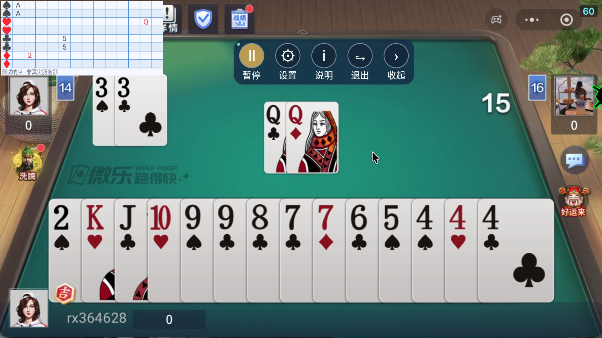
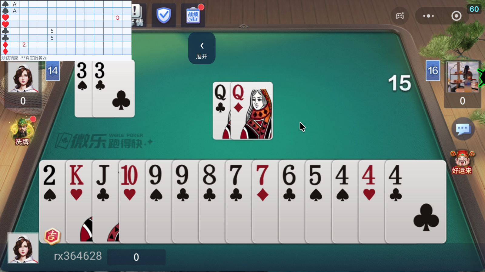

# JiPaiQi Mobile · v2

Android 十三水两副牌手牌识别客户端（104 张，无大小王，每手 13 张）。当前版本 0.3.1，Android 8.0+、ARM64；旧版出牌记牌器保留在 `v1` 分支。APK 使用开发测试签名，未发布应用商店。

## 使用

1. 从 `dist/JiPaiQi-Mobile-0.3.1-debug-arm64.apk` 安装。
2. 在 JPQ Tools v2 采集新游戏的我方手牌区域、各点数＋小花色联合模板、新局与结束特征，导出完整 ZIP 并导入。旧识别包仅保留用于兼容和测试，不作为十三水识别配置。客户端运行牌库固定为十三水两副牌 104 张，不使用旧包的跑得快牌库。
3. 点击“开启悬浮控制”，允许悬浮窗、屏幕采集和必要通知权限。切换到横屏游戏，再点悬浮栏“启动”。
4. 悬浮栏含启动/暂停、设置、说明、退出、收起。拖动可移动，收起按钮至少 48dp，可拖动；点击在当前位置展开，靠近边缘时仅调整到屏幕内，不跳转屏幕中央。隐藏不等于暂停。
5. 左上角结果面板可拖动，点击面板隐藏；长按控制栏“收起”，或主页“显示 / 隐藏服务器面板”恢复。
6. 在“我方手牌 / 服务器上传”中设置 HTTPS 接口并手动启用上传；修改上传设置前先停止识别。目前没有服务器地址，默认不上传，也不会伪造服务器返回数据。
7. 退出按钮或通知中的停止释放采集、悬浮窗和网络线程。

## 识别与显示规则

- 必须先检测到新局，再连续至少 2 次确认到正好 **13 张自己的手牌**，点数、花色全部合法，才生成请求。重复牌计入总数；少于/多于 13 张、未知花色不发送。
- 本版按参考图两副牌设计，同点数同花色最多 2 张。不支持大小王。
- 请求 cards 数组恰好 13 条，每条包含点数与花色，重复牌分别保留。每局只生成一个请求；网络重试复用同一事件 ID。暂停、短暂消失和排序变化不会重复生成。
- 服务器响应按花色和点数映射到 8 行 × 13 列面板。四种花色各两行，第二张相同身份显示在第二行；列按 A 2 3 4 5 6 7 8 9 10 J Q K 排列，不显示顶部数字标题行。
- 面板仅显示服务器响应，本地识别结果不填入面板。新局/结束清空旧结果，局 ID、请求 ID 不匹配的响应丢弃。
- 截图在内存处理，不保存截图文件、不上传截图。上传包含手牌及事件元数据。测试截图只由独立测试 APK 生成。
- 悬浮窗遮住采集区域、竖屏或屏幕关闭时暂停识别，请收起、隐藏或移动悬浮窗。

请求/响应草案、映射和失败处理见 [docs/hand-upload-v2.md](docs/hand-upload-v2.md)。当前没有服务端地址，鉴权尚待接口文档确定；无真实服务端联调结果。协议当前按 HTTPS POST 同步返回结果实现，异步推送需另外对接。

## 外观验证

下面是模拟器中的组件测试，格子使用固定测试响应，状态栏注明“非真实服务器”。不是实际服务器联调结果。




## 构建与测试

JDK 17、Android SDK 35 / build-tools 35.0.0，Gradle 8.11.1、AGP 8.9.2、OpenCV 4.12.0。

```sh
./scripts/build.sh
./scripts/device-tests.sh 127.0.0.1:16384
```

20 项 JVM 单元测试通过：13 张限制、重复牌、连续确认、每局去重、响应映射、旧局/错误请求过滤、响应大小限制及旧账本回归。

MuMu Android 12L / API 32 上 5 项设备测试通过：实际 MediaProjection 采集和结束锁定、悬浮栏收起/展开/面板隐藏、配置导入与失败恢复、原视频识别及缩放。截图与交互测试使用固定素材，无服务器请求。测试脚本会安装应用与测试 APK，打开测试画面；需要系统悬浮窗权限，跳过不代表通过。

## 边界

13 张校验保证发送数据满足数量与身份格式，不保证识别永不出错。新游戏仍需补齐模板并验证实战视频。仅当前截图采集的模板不能覆盖所有可能的牌面、皮肤或分辨率。

游戏的 FLAG_SECURE 可能导致采集黑屏，本版本不改变截屏保护。不能通过开启相机权限解决。iOS、32 位 Android 尚未提供构建。
