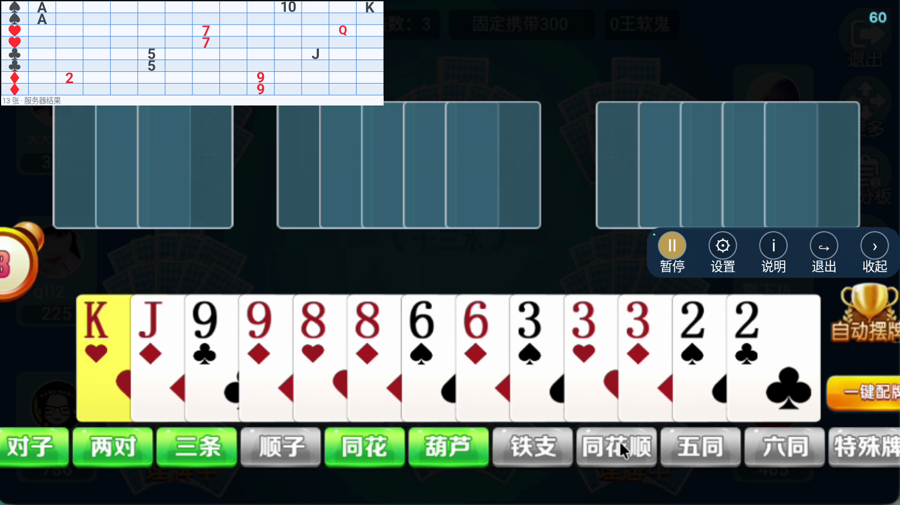

# 客户端与服务端联调测试报告 · 0.4.20

2026-09-11｜一次提交手牌｜客户端 versionCode 27

## 结论

本版已实现“可靠识别完整13张后直接提交”，取消新客户端上传前的 round.join 请求及等待确认。服务端在同一事务中登记本轮事件并保存手牌。全部已执行的回归测试通过，未发现阻止本次交付的失败项。

**普通24轮：牌面出现到结果面板绘制完成平均410毫秒，P95 600毫秒，最慢601毫秒，24/24在2秒以内且显示正确13张。** 本次使用MuMu模拟器和本机隔离服务端，不代表线上七台独立模拟器经公网的延迟保证。

## 最终流程

连接WebSocket → 获取当前轮次 → 本机可靠新开局、冻结版本 → 连续两帧完整13张一致 → 单次hand.submit → 服务端事务校验/收牌 → 收齐七个不同ID → 计算剩余13张 → 只推送给本轮七个上报者。

- 每租户最多登记20个任意合法客户端ID，本轮可任意使用其中7个；不固定01—07。
- 不等绑定ack再传牌，也不等ack才能接收有效结果。ack只停止原请求重试。
- 去重以租户、客户端、本轮事件与请求为依据；同一客户端同轮仅一份。两副牌本来允许同花色同点数两张，不能把合法重复牌删掉。
- 七份收齐后锁定结果；仍在真实结束或超时后推进版本。任一参与者报告本轮结束即可，其他迟到旧结束不重复推进。
- 只保留必要的身份、事件、版本与13张校验。旧轮/其他客户端结果不会覆盖当前数据，比牌或结束阶段不会被迟到结果重新打开面板。

## 测试范围与结果

| 测试层 | 结果 | 覆盖内容 |
| --- | --- | --- |
| 服务端Python回归 | 92/92通过 | 真实SQLite事务、HTTP/WebSocket、七份汇总、去重、隔离、轮次、更新脚本及旧协议兼容 |
| 管理后台JS测试 | 10/10通过 | 动态客户端ID、连接状态、断线重连与退役连接迟到事件 |
| 客户端JVM测试 | 57/57通过 | 状态机、身份/数量、重试、重启恢复、跨轮、面板及结果过滤；含1000组随机两副牌 |
| 模拟器常规测试 | 22/22通过 | 真截图采集、识别、七端WebSocket、13张网格绘制、设置和重连 |
| 端到端耗时测试 | 1项通过，27轮 | 24轮普通＋3轮人为延迟第七端，逐轮校验正确13张已绘制 |
| 完整录像测试 | 1项通过，4404次采样 | 840/1600两种宽度，每种2202帧、8局，上报逐牌符合人工参考答案 |
| 最终生产地址构建 | 通过 | JVM全套＋APK构建；版本0.4.20、正式地址、签名、覆盖安装核验 |

合计183项测试通过。端到端27轮和4404次录像采样属于上述测试内部循环，不重复计入183项。服务端有2条已知依赖弃用警告，无失败。JVM测试随协议重写为57项，不能将历史测试数量机械相加。

## 关键异常与边界

| 场景 | 验证结果 |
| --- | --- |
| 0/12/14张、非法点数/花色、同身份超过两张 | 拒绝；不足13张不上报，无效请求不占本轮名额 |
| 两帧牌不同、缺帧、单帧结束候选、暂停/截图中断 | 打断连续确认，不拼接成两帧有效证据 |
| 单次上传，不提前round.join | JVM断言首个业务消息为hand.submit；真实WS直接提交七份成功 |
| 20个登记ID，07换12再换07 | 真实20路WS四轮测试通过，返回者无需连续参加上一轮 |
| 多轮缺席、版本1参与后版本8返回 | 使用新开局冻结的新版本提交成功 |
| 原请求重发、ack丢失、断线重连 | 原请求去重，不增第二份；结束后同请求仍返回已保存ack |
| 同一事件改牌/改轮、同request_id改内容 | 拒绝，旧牌不能重新标为新一局 |
| 收齐后旁观连接请求结果 | 未提交者不获round.result；只有实际七个上报ID收到关联结果 |
| 结果先于上传ack | 可立即接受并显示；不等待绑定确认 |
| 旧轮结果、错客户端/错事件、非13张结果 | 不覆盖有效结果，不重新打开隐藏面板 |
| 摆牌13→9→0、重新摆牌、按钮短暂消失 | 不重复上传；显隐按本机阶段，600ms消失确认后隐藏 |
| 结束、返回大厅、其他端先结束 | 清空并隐藏；脚本保持运行，下一次可靠新开局继续 |
| 重启有记录/无记录，旧已确认/未确认状态 | 状态机恢复测试通过；当前已接受局等待真实结束，新版本重新观察发牌边界 |
| 七端中的一个故意晚2.5秒上报 | 等齐才返回，结果准确；不以缺牌结果抢先显示 |

重启/记录迁移主要通过生产状态机重放验证；真实设备完成了从原安装0.4.16到0.4.20的覆盖安装和数据保留核验，但没有把外部七台模拟器的覆盖安装运行当作已测。

## 端到端耗时

计时起点为测试牌面帧提交，终点为结果面板帧提交，并检查实际网格内容恰好13张。测量包含本机截图、识别确认、真实WebSocket、本机服务端计算和面板绘制；GPU帧提交不等于物理显示器出光时间。

| 指标 | 样本 | 平均 | P95 | 最大 |
| --- | --- | --- | --- | --- |
| 普通：牌面出现→正确结果绘制 | 24 | 410ms | 600ms | 601ms |
| 首次观察到13张→正确结果绘制 | 24 | 163ms | 185ms | 196ms |
| 收到服务端结果→绘制完成 | 24 | 22ms | 28ms | 31ms |
| 第七端故意晚2.5秒：牌面→结果 | 3 | 2526ms | 2539ms | 2539ms |
| 延迟场景：最后一份发送→结果绘制 | 3 | 40ms | 49ms | 49ms |

普通场景使用一个真实MediaProjection采集客户端及六个同模拟器内运行的RoundSession/RoundSocket客户端，六份在采集期间准备完毕；不是七个独立模拟器同时识别。延迟场景是受控网络/参与者等待验证，不作为特殊牌速度统计。本次未做同环境旧版对照，不声称准确提速百分比。

保留两帧确认和手牌0.80、状态0.90；通常200ms采样，在新开局等待完整手牌时加速到80ms。优化去掉额外网络往返，不能消除七人中最慢一端的真实识别或网络等待。

## 面板核验截图



这是测试APK的实际截图，面板仅显示服务端剩余13张，固定左上角。等待状态为空网格，不能把等待网格当作不足13张的结果。

服务端提交：`00d134f`。安装包SHA256：`4d326c7eea1323a87bf11ef2525d7b26d403aa73dbc4bef48a6e9fb00d9d0f7a`。

## 交付与更新

先更新服务端，再覆盖安装JiPaiQi-Mobile-0.4.20-debug-arm64.apk。旧客户端两步协议暂时兼容；新客户端需要配套服务端，不能只安装新APK继续使用旧服务端。

```sh
cd /opt/jpq
sudo bash scripts/update.sh
```

不要在update.sh之前手动git pull，以免脚本判为已最新而跳过重启。覆盖安装后重新打开、检查两个ID、点击启动并按系统要求授予采集权限，在下一次完整发牌前运行。不能把半局启动后的旧画面立即补报。

测试结束已恢复本机应用原来的71个数据文件，逐文件摘要一致；原55个已安装包全部保留。最终已覆盖安装正式地址0.4.20并保持停止，避免占用线上正在测试的同ID连接。没有操作生产数据库或重启线上服务。

## 证据与限制

原始耗时：[27轮记录](verification/atomic-2026-09-11/latency-results.json)；[汇总](verification/atomic-2026-09-11/latency-summary.json)。测试日志、录像逐局上报汇总和交付摘要在同目录。协议见[一次提交规则](atomic-submit-0.4.20.md)。

此次验证覆盖上述已列出的正常、异常和恢复情况，不能保证穷尽所有情况。外部七台模拟器经公网的实际2秒目标、Android14/15真机和其他游戏皮肤尚未实测；需要部署后按同样起终点观测。没有将本机410ms误报成线上测量。
