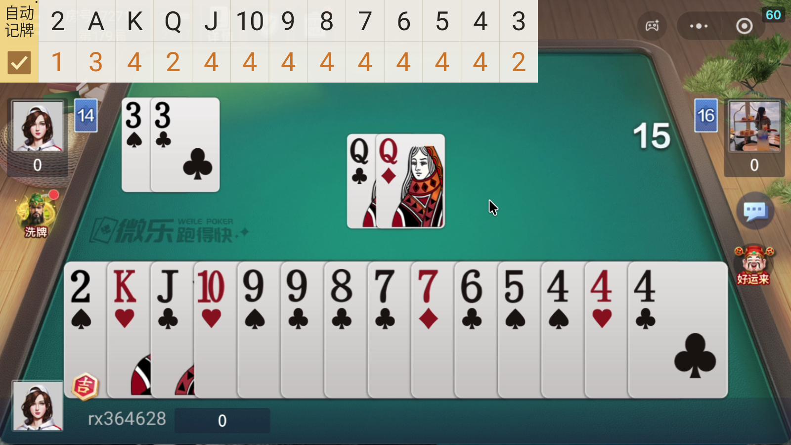
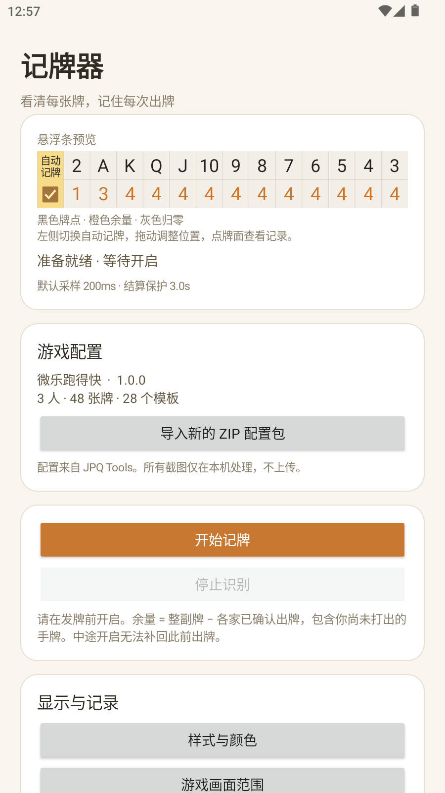

# 首版验证记录

日期：2026-09-09。测试对象：Android ARM64 调试版 0.1.0。

- 构建：JDK 17、Gradle 8.11.1、AGP 8.9.2、SDK 35，assembleDebug 成功。
- 账本单元测试：11 项通过，0 失败、0 跳过。覆盖结束优先、候选保护、重复显示、消失不撤销、跨局隔离、人工核对、原子扣牌和张数上限。
- MuMu 设备测试：Android 12L / API 32 / ARM64，横屏 1600×900。4 项通过，0 失败。测试使用独立测试 APK 显示用户提供视频的真实帧。
- OpenCV 测试：区域交叉处的 33/QQ、三张 A、左右与我方同时出牌、右方两行十张顺子、结算模板；原始 1680×948 与缩小画面均检查。
- 真实 MediaProjection：通过系统录屏授权，显示悬浮条，识别并计入 33/QQ；持续显示不重复扣牌；静止切换结算后锁定；停止释放服务。不是只向账本注入识别结果。
- 配置包：路径越界及损坏 manifest 拒绝导入，原已安装配置不变。
- Android lint：0 error。剩余 warning 为依赖版本提示、ARM64 构建不含 ChromeOS x86、旧版备份属性、中文文本拼接和固定左侧坐标等，详见构建生成的 lint 报告。

## 已发现并修复

静止屏幕不会持续产生 ImageReader 缓冲，原先依赖图像回调导致结算保护时间不能推进。现在图像到达时保留最新缓冲，由配置采样时钟处理，静止时推进最后观察的时序。

MuMu 对仅更新一次后静止的测试画面，屏幕镜像曾停在上一画面。悬浮条增加每 500ms 切换的微小运行指示点，维持合成刷新；测试保留静止画面切换场景验证，未靠持续播放测试素材掩盖问题。暂停、遮挡、旋转及采集停止会清除旧观察。

## 未验证范围

没有把完整视频全部人工标注，因此这些测试不能给出整段视频的识别准确率。Android 14/15+ 已按接口处理录屏授权和前台服务，但还未在对应真机上验证。其他分辨率、游戏排布、皮肤及设备省电策略需要真机实测。

配置中没有我方初始手牌识别，也没有可靠回合身份信号。余量包含我方未出手牌；相同牌组再次出现及临近结算候选可能需要人工确认。

## 实际界面

